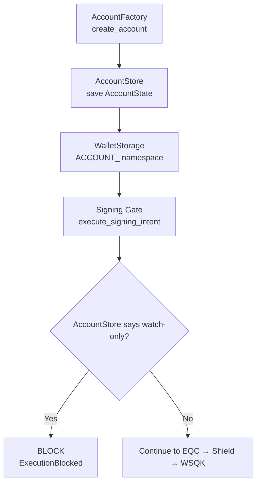

# Account Watch-Only Data Path — Persisted State → Signing Gate

**Author:** DarekDGB  
**License:** MIT  
**Status:** AUTHORITATIVE (Phases 12 + 11)

This diagram documents how **watch-only** is enforced as **persisted data**.

Watch-only is not a UI flag.
It is stored in account metadata and enforced at the signing gate.

---

## Data + Enforcement Path

---

## Invariants

- watch-only is stored in `AccountState.watch_only`
- signing is blocked **before** EQC, Shield, or WSQK when watch-only is true
- clients must not implement their own watch-only enforcement (the gate does it)

---

## Code References

- Account creation: `core/wallet/account_factory.py`
- Account state store: `core/wallet/account_store.py`
- Signing gate: `core/runtime/shield_signing_gate.py`
- Storage interface: `core/storage/interface.py`
