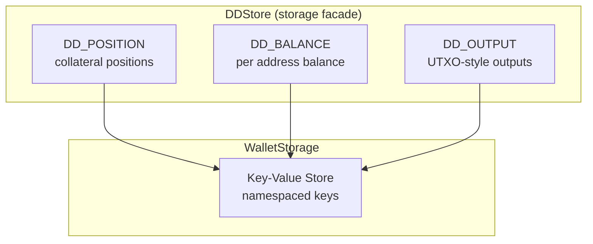
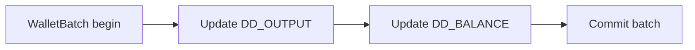

# DigiDollar (DD) Storage Model

**Author:** DarekDGB  
**License:** MIT  
**Status:** LOCKED / AUTHORITATIVE (Phase 14)

This diagram documents the **DigiDollar persistence model** inside Adamantine Wallet OS.

It is a **storage view only**:
- No minting logic
- No redeem logic
- No protocol rules

All DD state is persisted via `DDStore` and `WalletStorage`.

---

## DD Storage Model (Locked)

---

## Atomic Update Rule

Certain DD updates must be applied **atomically** using `WalletBatch`.

If any step fails:
- the batch is rolled back
- no partial DD state is persisted

---

## Key Namespace Contract

All DD keys are prefixed with `DD_`:

- `DD_POSITION:{position_id}`
- `DD_BALANCE:{wallet_id}:{account_id}:{address}`
- `DD_OUTPUT:{txid}:{vout}`

This contract is **stable** and must not change without a migration.

---

## Code References

- DD store: `core/dd/dd_store.py`
- Atomic helper: `DDStore.apply_atomic(...)`
- Storage interface: `core/storage/interface.py`
- Storage backends:
  - `core/storage/memory_store.py`
  - `core/storage/sqlite_store.py`

---

## Design Note

DD storage is intentionally **dumb**.

All rules live **above** this layer:
- EQC
- Shield
- WSQK
- Protocol logic (future)

This separation is required for safety and auditability.
