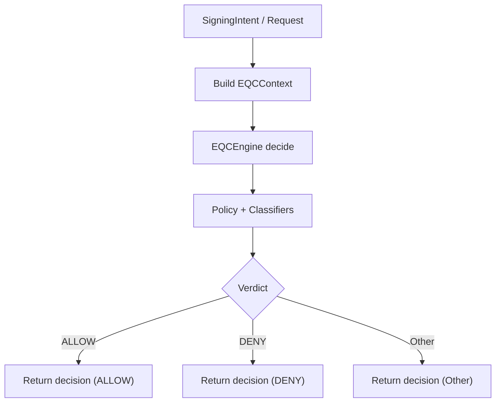

# EQC Decision Flow — Context → Verdict (Decision-Only)

**Author:** DarekDGB  
**License:** MIT  
**Status:** AUTHORITATIVE (Phase 11+)

This diagram documents **EQC** as a **decision-only** engine.

EQC:
- builds a deterministic context
- evaluates policy/classifiers
- returns a verdict (ALLOW / DENY / …)

EQC must **never**:
- sign
- execute
- hold keys
- mutate network state

---

## EQC Flow

---

## EQCContext Inputs (Examples)

EQCContext is composed from multiple sub-contexts:

- ActionContext (action, asset, amount, recipient)
- DeviceContext (device_id, trusted, app_version)
- NetworkContext (network, node_trusted, entropy_score, fee_rate)
- UserContext (user_id, biometric_available, pin_set)
- Extra fields (includes intent_hash)

> The important invariant: EQC output is deterministic for the same context.

---

## Contract

- Input: `EQCContext`
- Output: `EQCDecision` with `verdict.type`
- Required for signing gate: **verdict must be `ALLOW`**

---

## Code References

- Context types: `core/eqc/context.py`
- Engine: `core/eqc/__init__.py` (EQCEngine)
- Verdict types: `core/eqc/verdicts.py`
- Gate usage: `core/runtime/shield_signing_gate.py`
