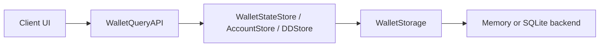

# Query API Boundary — Read-Only Client Access

**Author:** DarekDGB  
**License:** MIT  
**Status:** AUTHORITATIVE (Phase B)

This diagram documents the **read-only boundary** for client layers.

Clients may read wallet/account/DD state via `WalletQueryAPI`, but must not:
- sign
- execute
- mutate state
- bypass the signing gate

---

## Read-Only Boundary

---

## Invariants

- `WalletQueryAPI` is read-only by design.
- Signing and execution require the Signing Gate:
  - `execute_signing_intent(...)`
- Storage backends are interchangeable; clients must not depend on backend details.

---

## Code References

- Query API: `core/wallet/query_api.py`
- Stores: `core/wallet/state_store.py`, `core/wallet/account_store.py`, `core/dd/dd_store.py`
- Storage interface: `core/storage/interface.py`
- Backends: `core/storage/memory_store.py`, `core/storage/sqlite_store.py`
- Signing gate: `core/runtime/shield_signing_gate.py`
