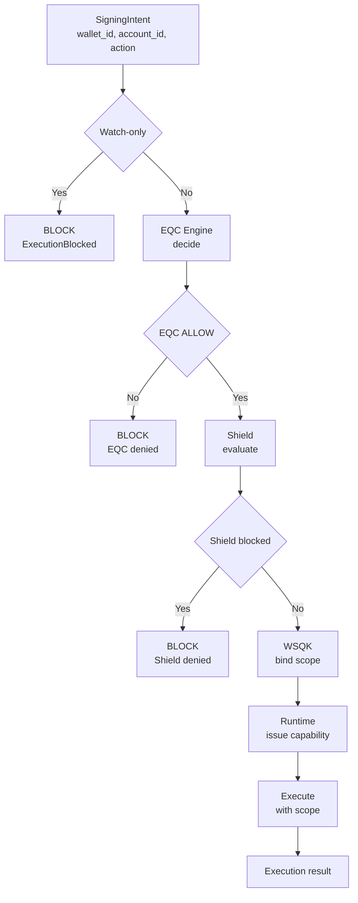

# Signing Gate Flow — EQC → Shield → WSQK → Runtime

**Author:** DarekDGB  
**License:** MIT  
**Status:** LOCKED / AUTHORITATIVE

This diagram is **authoritative** for all sensitive execution
(signing, minting, authorization).

There is **one supported entrypoint only**:

- `execute_signing_intent(...)`  
  (`core/runtime/shield_signing_gate.py`)

Any execution path that bypasses this flow is **invalid by architecture**.

---

## High-Level Flow (Locked)

---

## Enforced Invariants (Non-Negotiable)

1. **Watch-only check is first**
   - If an account is watch-only, execution is blocked immediately.
   - No EQC, Shield, WSQK, or Runtime interaction occurs.

2. **EQC is decision-only**
   - Produces a verdict (`ALLOW` / deny).
   - No keys.
   - No signing.
   - No execution.

3. **Shield is a secondary gate**
   - Shield may block even when EQC allows.
   - Shield never signs or executes.

4. **WSQK executes, it does not decide**
   - Scope is derived from EQC decision + intent context.
   - Scope is time-bounded (TTL) and context-bound.
   - No persistent private keys.

5. **Runtime enforces capability**
   - Execution requires a valid runtime capability.
   - No direct signing APIs exist.

---

## Code References

- Signing gate entrypoint:  
  `core/runtime/shield_signing_gate.py`

- EQC context construction:  
  `core/eqc/context.py`

- WSQK scope binding:  
  `core/wsqk/context_bind.py`

- WSQK executor:  
  `core/wsqk/executor.py`

- Runtime capability enforcement:  
  `core/runtime/capabilities.py`

---

## Architectural Rule

> **No signing without approval.  
> No approval without reason.  
> No execution without authority.**

This rule is enforced by **architecture, code, and tests**, not convention.
