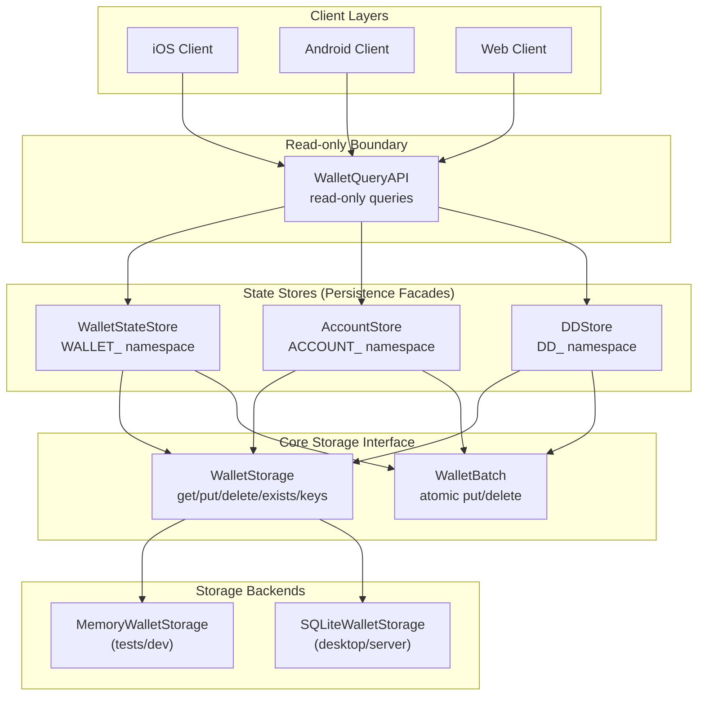

# Storage Architecture — WalletStorage · WalletBatch · Namespaces

**Author:** DarekDGB  
**License:** MIT  
**Status:** LOCKED / AUTHORITATIVE (Phases 12–14)

This diagram documents the **persistence boundary** of Adamantine Wallet OS.

- All persisted state goes through **WalletStorage**
- Atomic multi-key updates go through **WalletBatch**
- Storage backends are interchangeable (Memory / SQLite / future mobile secure store)

---

## High-Level Model (Locked)

---

## Namespaces (Key Prefix Contract)

Storage keys are **namespaced** and must remain stable:

- `WALLET_*` — wallet state (e.g. wallet metadata)
- `ACCOUNT_*` — account metadata (including **watch-only**)
- `DD_*` — DigiDollar storage view:
  - `DD_POSITION:*`
  - `DD_BALANCE:*`
  - `DD_OUTPUT:*`

> Business logic must not depend on backend internals.  
> It only depends on the namespace contract and store APIs.

---

## Atomicity Rule

Any update that must not be partially applied must use `WalletBatch`:

Examples:
- multi-key DD updates (outputs + balances)
- future protocol state transitions requiring all-or-nothing persistence

---

## Code References

- Storage interface: `core/storage/interface.py`
- Memory backend: `core/storage/memory_store.py`
- SQLite backend: `core/storage/sqlite_store.py`
- Wallet state: `core/wallet/state_store.py`
- Accounts: `core/wallet/account_store.py`, `core/wallet/account_factory.py`
- DigiDollar storage: `core/dd/dd_store.py`
- Read-only client API: `core/wallet/query_api.py`
