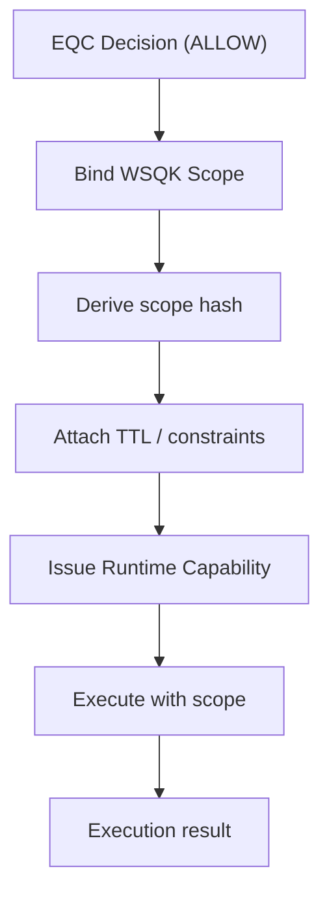

# WSQK Execution Scope — Scoped, Time-Bound Execution

**Author:** DarekDGB  
**License:** MIT  
**Status:** AUTHORITATIVE (Phase 11+)

This diagram documents **WSQK (Wallet-Scoped Quantum Keys)** as an
**execution-only** mechanism.

WSQK:
- does not decide
- does not evaluate policy
- does not persist keys
- executes only within a bound scope

---

## WSQK Execution Flow

---

## Scope Properties (Invariants)

A WSQK scope is:

- **Context-bound**
  - Derived from EQC decision + intent hash
- **Time-bound**
  - TTL enforced by runtime capability
- **Single-purpose**
  - Scope is valid only for the intended action
- **Non-persistent**
  - No long-lived private keys are stored

---

## What WSQK Is NOT

WSQK is **not**:
- a policy engine
- a wallet seed
- a general signing API
- a persistent key store

All authority comes **from EQC**.
All enforcement comes **from Runtime**.

---

## Contract

- Input: EQC decision + intent context
- Output: execution within a valid scope
- Failure conditions:
  - expired TTL
  - scope mismatch
  - missing runtime capability

---

## Code References

- Scope binding: `core/wsqk/context_bind.py`
- Executor: `core/wsqk/executor.py`
- Runtime capabilities: `core/runtime/capabilities.py`
- Gate integration: `core/runtime/shield_signing_gate.py`
